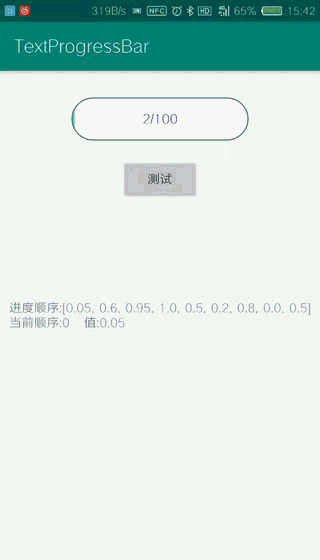

支持过渡动画的进度条

	功能比较简单,自己做出来主要是用来学习paint.setXfermode的各种效果.

# 首先直接放出效果:

# 控件说明:
+ 进度平滑过渡效果
+ 修改radius的值,可切换圆角或者直角
+ 颜色,边框,背景,中间文字可自定义

# 小缺点
+ 因为使用了paint的setXfermode,需要计算重叠图层的交集部分,所以圆角的背景不能为纯透明的.在xml中将"app:progress_bg_color的值跟所在的背景同一种颜色值即可.问题不是很大.